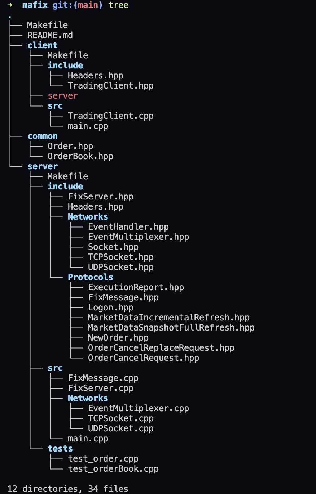

# MAFIX

MAFIX is a project that simulates the Market Digital Act.

## Description

This project aims to provide a realistic simulation of market dynamics, allowing users to test trading strategies and algorithms in a controlled environment.

## Features

### Server (Financial Market):

- Developed in C++.
- Adheres to the FIX (Financial Information eXchange) protocol for order communication.
- Utilizes a server-client architecture.
- Accepts and processes Logon/Logout messages.
- Manages incoming orders from trading tools.

### Client (Trading Tool):

- Developed in C++.
- Communicates with the financial market server using the FIX protocol.
- Capable of serializing and deserializing FIX messages.
- Connects to the server using Logon/Logout messages.
- Sends various types of orders (create, modify, cancel, trade) to the financial market.

## Architecture



## Installation

To install MAFIX, clone the repository and compile the source code:

```bash
git clone https://github.com/username/mafix.git
mkdir bin
make run_server
make run_client
```

## Usage

To run a simulation, use the following command:

```bash
./_server #in the first terminal

./_client #in the second terminal
```

## Possible problems

- The communication is established but the server does not yet correctly manage the messages
- Check the path of the libraries used present in the makefiles
